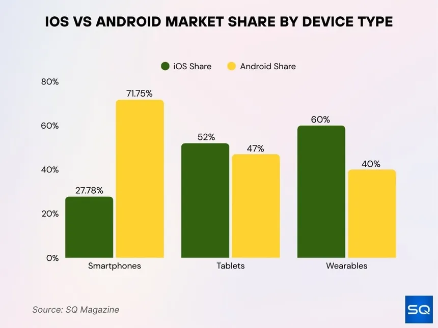
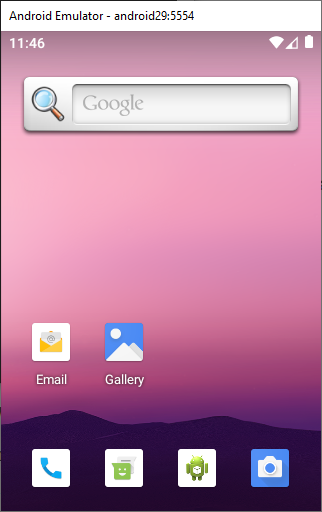

---

# Il Mercato Mobile Oggi

## Apple vs Android



Prima di scrivere una riga di codice, dobbiamo capire **dove** stiamo sviluppando.

- **Market Share:** Chi ha più utenti nel mondo?
- **Revenue:** Chi genera più profitti per gli sviluppatori?
- **Filosofia:** Sistema chiuso (Walled Garden) vs Ecosistema aperto.

---

# Oltre lo Smartphone

## Dove gira Android oggi?

Sviluppare in Android non significa solo fare app per telefoni. Il mercato si è espanso a dismisura:

- ⌚ **Wear OS:** Smartwatch e fitness tracker.
- 📺 **Android TV:** Smart TV e set-top box.
- 🚗 **Android Auto / Automotive:** Infotainment integrato nei veicoli.
- 🥽 **Realtà Estesa (XR):** Visori e smart glasses.

Una sola base di codice, infiniti dispositivi.

---

# Dibattito: Scegli il tuo lato

Se un'azienda vi desse **100.000€** per sviluppare la prossima app virale, su quale piattaforma la lancereste per prima? Perché?

<br>

<div style="position:absolute; left:0; right:0; top:50%; transform:translateY(-50%); display:flex; justify-content:center; align-items:center; gap:80px;">
  
  
</div>

---

# Sviluppo Nativo vs Cross-Platform

## Una scelta architetturale

Oltre a iOS vs Android, c'è un'altra grande guerra in corso:

- **Nativo (Kotlin / Swift):** Scrivi un'app specifica per un solo sistema. Massime prestazioni, accesso diretto all'hardware.
- **Cross-Platform (Flutter / React Native):** Scrivi il codice una volta sola e lo esporti per entrambi i sistemi. Risparmio di tempo, ma meno ottimizzato.

**Domanda per voi:** _Per un'app bancaria cosa scegliereste? E per un giochino 2D?_

---

# L'ecosistema Android (Il Passato)

## Java + XML

 Fino a pochi anni fa, sviluppare per Android significava:

- Scrivere la logica in **Java** (verboso e pesante).
- Disegnare l'interfaccia in file **XML** statici.
- Usare `findViewById` per collegare i due mondi.

**Risultato:** Crash continui per _NullPointerException_ e interfacce difficili da mantenere.

---

# L'ecosistema Android (Il 2026)

## Il passaggio a Kotlin

Oggi l'industria è passata a **Kotlin**.
Perché Google lo ha reso il linguaggio ufficiale?

1. **Sintassi Concisa:** Fai le stesse cose con il 50% del codice in meno.
2. **Null Safety:** Il compilatore ti impedisce di creare app che crashano per variabili vuote.
3. **Interoperabile:** Può leggere il vecchio codice Java.

---

# Kotlin: Un assaggio di sintassi

Guardate la differenza nella gestione di una variabile che potrebbe non esistere:

**Vecchio Java:**

```java
String nome = null;
if (nome != null) {
    System.out.println(nome.length());
}
```

---

# Kotlin Moderno:

```kotlin
var nome: String? = null
println(nome?.length) // Nessun crash, stampa solo "null"!
```

---

# Kotlin: le funzioni

## I nuovi mattoncini del codice

In Kotlin le funzioni sono di "prima classe". Non devono per forza vivere dentro una classe (addio verbosità di Java!).

```
// Una funzione semplice
fun calcolaSomma(a: Int, b: Int): Int {
    return a + b
}

// Funzione "Single-Expression" (ancora più breve!)
fun moltiplica(a: Int, b: Int) = a * b

```

---

# Kotlin: String Interpolation

Concatenare testi non è mai stato così facile

Dimenticate i fastidiosi `+` per unire testi e variabili.

**In Kotlin usa il simbolo `$`:**

```kotlin
val saluto = "Ciao $utente, hai $punti punti."
// Puoi anche fare calcoli dentro la stringa!
println("Il doppio dei tuoi punti è: ${punteggio * 2}")

```

---

# Dibattito: L'Era dell'Intelligenza Artificiale

## L'IA ci ruberà il lavoro da sviluppatori?

Oggi strumenti come ChatGPT, GitHub Copilot e Gemini scrivono codice in pochi secondi.

- Se l'IA può generare un'app, a cosa serve un programmatore umano?
- Chi controlla l'architettura, la sicurezza e l'etica di quel codice?
- Come useremo noi l'IA in questo corso? (Spoiler: Come un nostro assistente junior).

---

# Come si disegnano le App oggi?

## Addio XML, benvenuto Jetpack Compose

Oggi l'interfaccia è **Dichiarativa**.

> "Non dico al sistema come spostare i pixel, ma descrivo l'interfaccia in base ai dati che ho."

Se i dati cambiano $\rightarrow$ L'interfaccia si **ricompone** (aggiorna) automaticamente.

---

# I Componenti Visivi Base

In Jetpack Compose tutto è un `@Composable`.

I tre mattoncini fondamentali:

- 🧱 **Column:** elementi uno sotto l'altro
- 🧱 **Row:** elementi affiancati
- 📦 **Box:** elementi sovrapposti

---

# Esempio di Layout di Base

```kotlin
@Composable
fun  ProfiloUtente() {
  Row { // Immagine a sinistra, testi a destra
  Image(fotoProfilo)
  Column { // Nome sopra, bio sotto
  Text("Alfonso Zappia")
  Text("Sviluppatore Mobile")
 }
 }
}
```

---

# Material Design: non reinventare la ruota

Quando creiamo un pulsante, non partiamo da zero. Utilizziamo il **Material Design 3**, il linguaggio di design ufficiale di Google.

Include già componenti pronti all'uso e accessibili:

- `Button`
- `Card`
- `Scaffold` (per la barra superiore e inferiore)
- `FloatingActionButton`

---

# Personalizzazione: Modifier

Il `Modifier` è l'oggetto più importante di Compose. Serve per:

- Dimensioni (`size`, `fillMaxWidth`)
- Spazi (`padding`, `offset`)
- Aspetto (`background`, `clip`, `border`)
- Azioni (`clickable`, `scrollable`)

---

# Il Cuore: Lo Stato (`State`)

```kotlin
@Composable
fun ContatoreSmart() {
    // Se 'count' cambia, Compose ridisegna il testo automaticamente
    var count by remember { mutableStateOf(0) }

    Button(onClick = { count++ }) {
        Text("Click totali: $count")
    }
}

```

---

# La Magia di @Preview

## Come vedere il risultato senza avviare l'app

Non serve installare l'app sul telefono per vedere ogni piccola modifica ai colori. Basta aggiungere `@Preview` sopra la nostra funzione e Android Studio ci mostrerà un'anteprima in tempo reale a lato del codice.

Kotlin

```
@Preview(showBackground = true)
@Composable
fun AnteprimaProfilo() {
    ProfiloUtente() // Chiama la funzione per vederla!
}

```

---

# Trova l'errore! (Mini-Quiz Rapido)

Cosa succede se eseguo questo codice in Kotlin?

Kotlin

```
fun main() {
    val vita = 100
    vita = vita - 10
    println("Ti rimangono $vita HP")
}

```

_Pensateci bene prima di rispondere... (Indizio: guardate come è dichiarata la variabile)._

---

# Mettiamoci alla prova!

## Kahoot Time 🕹️

Inquadra il QR Code con il tuo smartphone. Chi vince il quiz sceglie il tema dell'app del prossimo laboratorio!

<div align="center">

**PIN:** 123 456 7

</div>

---

# Roadmap del Corso

## Dalla teoria alla pratica

Il pomeriggio non faremo teoria. **Costruiremo app.**
Lavoreremo a piccoli progetti di difficoltà crescente:

1. 🧮 L'App Calcolatrice (Logica base)
2. 📖 La Rubrica (Gestione liste)
3. ☁️ Cinema App (Chiamate API a internet)
4. 💾 Il Diario (Salvataggio dati fisici)

---

# Il vostro ambiente di lavoro

## Setup per il pomeriggio

Utilizzeremo lo strumento standard dei professionisti: **Android Studio**.

- **Installazione Semplice:** Facilmente installabile sui PC del laboratorio e a casa (Windows/Mac/Linux).
- **Emulatore Integrato:** Potremo testare le app direttamente sul computer simulando qualsiasi dispositivo.
- **Device Fisico:** In alternativa, potrete collegare il vostro smartphone Android reale per vedere la vostra app prendere vita tra le vostre mani!

---

# Breve Demo 💻

<br>

Condivido lo schermo e vi faccio vedere una piccolissima Demo su Android Studio

---


