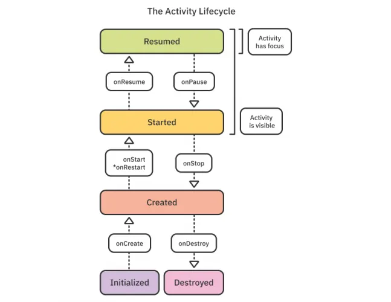

---

# Recap: Cosa sappiamo finora?

Nelle lezioni precedenti abbiamo:

- Scoperto Jetpack Compose (UI dichiarativa).
- Creato layout complessi con `Row`, `Column` e `LazyColumn`.
- Dato "memoria" all'app tramite lo **Stato** (`remember`).

Ma c'è un "nemico" invisibile che ancora non conoscete, e che può distruggere tutto il vostro lavoro in un secondo: **Il Sistema Operativo.**

---

# Obiettivi del Modulo 3

## Il Sottosopra di Android

1. **Chi comanda davvero?** Utente vs Sistema Operativo.
2. **Il Ciclo di Vita:** La metafora del teatro.
3. **Il Trauma della Rotazione:** Perché i dati spariscono.
4. **La Cura:** `rememberSaveable`.
5. **Side Effects:** Eseguire codice in modo sicuro.

---

# Parte 1: Chi comanda davvero?

## La gestione della memoria su dispositivi mobili

---

# Sviluppo PC vs Sviluppo Mobile

**Su un computer (Windows/Mac):**
Se aprite 50 programmi e la RAM si riempie, il PC rallenta, ventole al massimo, ma i programmi restano lì finché _voi_ non li chiudete. L'Utente è il Re.

**Su uno Smartphone (Android/iOS):**
La batteria è piccola e la RAM è preziosa. Se la RAM si riempie, il Sistema Operativo (Il Re) **uccide senza pietà** le app in background per salvare il telefono.

---

# Foreground vs Background

Per Android, le app si dividono in due categorie:

- 🟢 **Foreground (Primo Piano):** L'app che state guardando e toccando ora. È intoccabile, ha priorità assoluta sulle risorse.
- 🟡 **Background (Dietro le quinte):** Tutte le app minimizzate. Sono "congelate" o in attesa di essere uccise se serve memoria.

---

# Dibattito Reale: Il caso Instagram

Siete su Instagram e state scrivendo un post lunghissimo e bellissimo.
All'improvviso vi arriva una notifica su WhatsApp. Cliccate, aprite WhatsApp, rispondete (ci mettete 2 minuti).
Tornate su Instagram e... **Schermata nera, l'app si riavvia. Il post è sparito.**

_Di chi è la colpa? Del programmatore di Instagram, del vostro telefono scadente, o è un comportamento voluto?_

---

# La Colpa: OOM (Out Of Memory)

Non è un bug, è una feature.
Quando avete aperto WhatsApp, Instagram è passato in **Background**.
Il sistema aveva bisogno di RAM per caricare la tastiera di WhatsApp, quindi ha "ucciso" Instagram (OOM Kill).

Il vero errore (del programmatore) è stato **non salvare la bozza** prima di essere ucciso.

---

# Parte 2: La Metafora del Teatro

## Il Ciclo di Vita di un'App (Activity Lifecycle)

---

# Cos'è un'Activity?

In Android, ogni singola schermata della vostra app (o l'app intera, se usiamo Compose moderno) vive all'interno di un'**Activity**.

L'Activity non è solo grafica: è l'entità che Android monitora costantemente.
Il suo stato di vita cambia continuamente, proprio come **un attore in un'opera teatrale**.

---

# Il Diagramma del Terrore

 Se cercate su Google "Android Lifecycle", troverete questo schema.
Sembra complesso, ma andiamo a tradurlo con la nostra metafora del Teatro.

I passaggi chiave sono: `Create`, `Start`, `Resume`, `Pause`, `Stop`, `Destroy`.

---

# 1. onCreate()

## Gli attori provano i costumi

È il primo metodo chiamato quando aprite l'app.
L'Activity è in memoria, ma lo schermo è ancora bianco o sta caricando.

- **Nel Teatro:** Gli attori arrivano, si vestono, il regista prepara le luci.
- **Nel Codice:** Carichiamo variabili, prepariamo Jetpack Compose, leggiamo i dati salvati.

---

# 2. onStart()

## Il sipario si alza

L'Activity diventa visibile all'utente, ma non è ancora interattiva al 100% (potrebbe esserci un'animazione di ingresso in corso).

- **Nel Teatro:** Il sipario si apre. Il pubblico vede gli attori, ma non stanno ancora parlando.
- **Nel Codice:** Animazioni di ingresso, avvio dei sensori.

---

# 3. onResume()

## Sotto i riflettori

L'app è in primissimo piano. L'utente sta interagendo, toccando pulsanti e scorrendo liste.

- **Nel Teatro:** Gli attori recitano e interagiscono col pubblico.
- **Nel Codice:** L'app funziona a pieno regime. È lo stato "normale" in cui passate il 90% del tempo.

---

# 4. onPause()

## Squilla un telefono in sala

Qualcosa distrae l'utente, ma l'app è ancora _parzialmente_ visibile. Ad esempio, compare un popup di sistema, oppure si divide lo schermo a metà.

- **Nel Teatro:** Un rumore distrae la scena. Gli attori si fermano e aspettano, ancora sul palco.
- **Nel Codice:** Dobbiamo mettere in pausa i video, fermare la fotocamera o salvare dati sensibili rapidamente!

---

# 5. onStop()

## Il sipario cala

L'utente preme il tasto Home o apre un'altra app. La vostra app è totalmente invisibile, passa in Background.

- **Nel Teatro:** Sipario chiuso. Gli attori si riposano dietro le quinte, ma sono pronti a tornare se chiamati.
- **Nel Codice:** Dobbiamo liberare le risorse pesanti (es. spegnere il GPS, fermare animazioni cicliche) per non consumare batteria.

---

# 6. onDestroy()

## Il Teatro viene demolito

L'utente chiude forzatamente l'app (swipe verso l'alto) o Android la uccide per liberare RAM.

- **Nel Teatro:** Lo spettacolo è cancellato. Gli attori vanno a casa.
- **Nel Codice:** Fine dei giochi. L'app muore. L'unica cosa che sopravvive sono i dati salvati fisicamente nel telefono.

---

# Dibattito Reale: YouTube vs Spotify

State guardando un video su **YouTube** e premete il tasto "Home" (L'app va in `onStop`). Il video si ferma.

State ascoltando **Spotify** e premete "Home". La musica continua a suonare in sottofondo per ore.

_Se le regole di Android dicono che le app in background si fermano, perché Spotify è magico? Come fa ad aggirare le regole?_
_(Indizio: parleremo dei "Servizi" e delle Notifiche nel Modulo 6)._

---

# Parte 3: Il Trauma della Rotazione

## Come Compose gestisce il Sottosopra

---

# Provate a farlo adesso!

Aprite l'app "Calcolatrice" sul vostro telefono (o sul PC).
Scrivete `1234 + 5`.
Ora **ruotate il telefono** in orizzontale.
I numeri sono ancora lì? Speriamo di sì!

Per uno sviluppatore Android alle prime armi, la rotazione è un vero e proprio incubo.

---

# I "Configuration Changes"

Per Android, ruotare il telefono, cambiare la lingua del sistema o passare alla modalità scura sono considerati **Cambiamenti di Configurazione**.

Cosa fa Android quando rileva un cambiamento del genere?

1. Chiama istantaneamente `onDestroy()` (distrugge la schermata attuale).
2. Chiama `onCreate()` (la ricrea da zero con le nuove misure/lingua).

**Tutto questo accade in 0.1 secondi.**

---

# Perché Android è così "distruttivo"?

Perché il layout orizzontale potrebbe essere radicalmente diverso da quello verticale!
Distruggendo e ricreando tutto, il sistema si assicura di caricare le immagini e gli spazi corretti per le nuove dimensioni.

**Ma c'è un problema:** Se distrugge l'app... distrugge anche tutte le nostre variabili!

---

# Il fallimento del `remember` base

Ieri abbiamo usato questa riga di codice:

```kotlin
var punteggio by remember { mutableStateOf(0) }
```

`remember` protegge il dato dai continui ridisegni della UI, ma non sopravvive alla distruzione dell'Activity!
Se ruoto lo schermo, il mio punteggio torna a zero.

---

# La Soluzione Magica: `rememberSaveable`

Per dire a Compose: _"Ehi, questo dato è vitale, salvalo in una cassaforte esterna prima che Android distrugga lo schermo!"_, ci basta aggiungere una parola.

```
// Questa sopravvive alla rotazione!
var punteggio by rememberSaveable { mutableStateOf(0) }

```

---

# Dietro le Quinte: Il Bundle

Come fa `rememberSaveable` a funzionare?

Usa il meccanismo nativo di Android chiamato **Bundle** (un pacco postale).

1.  Ruoti lo schermo $\rightarrow$ L'app viene uccisa, ma prima mette `punteggio` in un "Pacco postale".
2.  L'app rinasce in orizzontale $\rightarrow$ Apre il pacco e ripristina la variabile.

_Attenzione: il Bundle può salvare solo dati piccoli (numeri, stringhe, boolean). Non metteteci foto in HD!_

---

# Parte 4: Effetti Collaterali

## Comunicare col mondo senza rompere la UI

---

# L'infinito Loop (Bug pericoloso)

Ricordate? Compose si aggiorna ogni volta che cambia uno stato. Immaginate di voler scaricare i dati dal server appena aprite l'app:

```
@Composable
fun MeteoApp() {
    var temperatura by remember { mutableStateOf(0) }

    // 🚨 ERRORE GRAVE 🚨
    temperatura = scaricaMeteoDaInternet()

    Text("Oggi ci sono $temperatura gradi")
}

```

---

# Perché è un errore grave?

1.  L'app si apre, `temperatura = 0`.
2.  L'app scarica il meteo e cambia in `25`.
3.  Compose rileva un cambio di stato e si _ridisegna_.
4.  Nel ridisegnarsi, rilegge il codice e **riscarica di nuovo il meteo**.
5.  All'infinito. Risultato? App bloccata e dati finiti.

Abbiamo bisogno di uno spazio sicuro: un **Effetto Collaterale**.

---

# Il Lanciatore: `LaunchedEffect`

Il `LaunchedEffect` è un blocco magico di Compose. Serve ad eseguire codice _solo una volta_, quando il componente appare sullo schermo.

```
@Composable
fun MeteoApp() {
    var temperatura by remember { mutableStateOf(0) }

    // Questo blocco parte UNA SOLA VOLTA all'avvio
    LaunchedEffect(Unit) {
        temperatura = scaricaMeteoDaInternet()
    }

    Text("Oggi ci sono $temperatura gradi")
}

```

---

# Caso d'uso reale: Splash Screen

## Animazioni all'avvio dell'app

Avete presente l'animazione di Netflix prima di vedere i film? Spesso usa un `LaunchedEffect` con un ritardo!

```
LaunchedEffect(Unit) {
    delay(2000) // Aspetta 2 secondi
    passaAllaSchermataPrincipale()
}

```

Non importa quante volte l'interfaccia si aggiorni, questo timer partirà una volta sola.

---

# Mettiamoci alla prova!

## Kahoot Time 🕹️

Vediamo se avete capito chi uccide le app e perché!

---

# Kahoot Time!

<div align="center">

**PIN:** 696660

</div>

---

# Parte 5: Verso il Laboratorio

## Demo: Il Timer Buggato

---

# Il Progetto del Laboratorio

Per capire davvero il Ciclo di Vita e lo Stato, non c'è nulla di meglio che costruire un **Cronometro/Timer**.

Cosa faremo:

1.  Creeremo un timer che conta i secondi.
2.  Lo faremo partire usando un `LaunchedEffect`.
3.  Vi mostrerò **il bug della rotazione** in diretta.
4.  Lo aggiusteremo con un `rememberSaveable`.

---

# Architettura del Timer

Ci serviranno:

- Uno stato `timer` per il numero a schermo.
- Uno stato `inEsecuzione` (Booleano: Play o Pausa).
- Un bottone per alternare lo stato `inEsecuzione`.
- Un `LaunchedEffect` che si riattiva ogni volta che premiamo Play, creando un ciclo continuo (`while(inEsecuzione) { delay(1000); timer++ }`).

---

# Breve Demo 💻

_(Condivido lo schermo, apriamo Android Studio e vediamo il ciclo di vita distruggere la nostra app in diretta!)_
