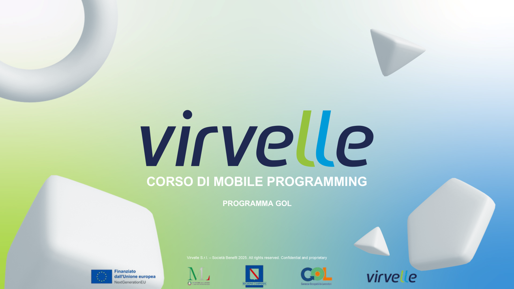
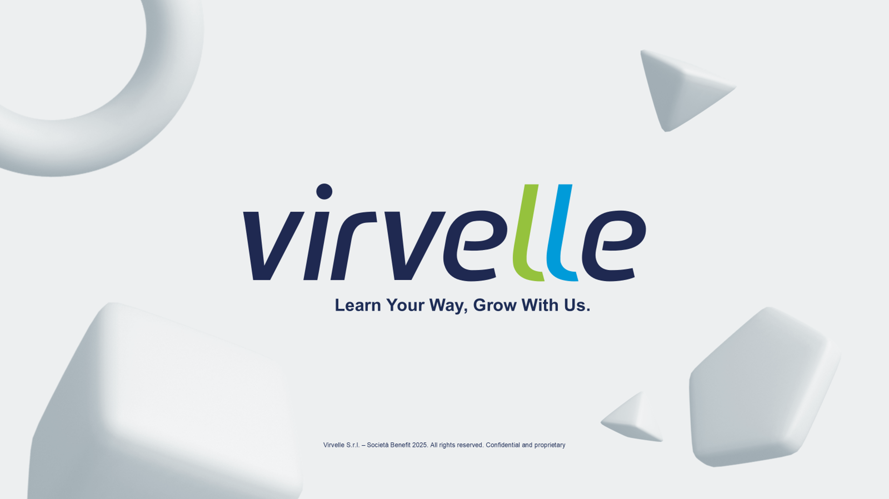

---

# Benvenuti al Laboratorio 3! 💻

Fino ad ora abbiamo costruito app "piatte", composte da una sola schermata.
Ma le app reali sono fatte di viaggi: si clicca un prodotto, si apre il dettaglio, si va al carrello.

Oggi impariamo a **Navigare**.

**Come funzionano i Laboratori:**

1. 🧠 **Briefing & Recap:** 10 minuti di ripasso.
2. 👨‍🏫 **Scaffolding (Insieme):** Scriviamo l'architettura base guidati da me.
3. 🚀 **Sfida Autonoma:** Aggiungete funzionalità da soli (o in team).

---

# Recap Rapido: I 3 Mattoncini di Oggi

Per muoverci tra le schermate in Jetpack Compose, useremo:

1. **Il NavController:** Il "pilota" che guida l'utente da una schermata all'altra.
2. **Il NavHost:** La "mappa" che contiene tutte le rotte possibili della nostra app.
3. **Il Salvataggio (rememberSaveable):** Il nostro giubbotto di salvataggio per non perdere i dati se l'utente ruota lo schermo durante il viaggio.

---

# Il Progetto di Oggi

## 🧠 L'App Quiz (Navigazione e Stato)

---

# Il Problema Reale

Siete arrivati alla domanda 10 di un quiz difficilissimo, o state compilando un modulo infinito per un acquisto online.
Ruotate il telefono per leggere meglio e... **Boom. L'app si riavvia e tornate alla pagina iniziale.** Un incubo per l'utente, un errore da principianti per lo sviluppatore. Oggi impareremo a evitarlo!

---

# Architettura dell'App

La nostra App Quiz avrà 3 "Stanze" (Schermate) distinte:

1. 🏠 **Schermata Home:** Titolo del quiz e bottone "Inizia".
2. ❓ **Schermata Domanda:** Mostra la domanda attuale e 4 bottoni per le risposte. _Questa schermata si aggiornerà 5 volte!_
3. 🏆 **Schermata Risultati:** Mostra il punteggio finale e il bottone "Gioca Ancora" che ci riporta alla Home.

---

# Fase 1: Scaffolding

## (Lo facciamo insieme)

---

# Cosa faremo ora nella Fase 1

Aprite Android Studio. Io condividerò lo schermo e costruiremo insieme **i binari** della nostra app.

1. Creeremo il `NavHost` con le due rotte principali: `"home"` e `"quiz"`.
2. Imposteremo la `List` con 5 domande finte (Mock Data).
3. Creeremo la logica di base: una variabile per tenere traccia dell'indice della domanda corrente e una per il punteggio.
4. Faremo il primo "salto" (Navigazione) dalla Home alla prima Domanda.

_Preparate le tastiere, vi aspetto pronti con un progetto vuoto!_

---

# Fase 2: Sfida Autonoma

## (Tocca a voi)

---

# Il vostro turno

Adesso che sappiamo viaggiare tra le schermate, il quiz è nelle vostre mani.
Come sempre, avete **due Task** da completare. Il primo per rendere l'esperienza piacevole alla vista, il secondo per renderla solida come la roccia.

---

# 🎨 Task 1: Sfida Grafica (UI & Feedback)

Un quiz deve dare soddisfazione quando si risponde!

- **Barra di Progresso:** Inserite un `LinearProgressIndicator` in alto (Es: se sono alla domanda 2 di 5, la barra sarà piena al 40%).
- **I Bottoni delle Risposte:** Metteteli in una griglia o in una colonna ordinata con un bel padding.
- **Feedback (Bonus logico-visivo):** Se premo la risposta giusta, il bottone diventa temporaneamente **Verde**. Se sbaglio, **Rosso**.

---

# ⚙️ Task 2: Sfida Logica (Sopravvivenza e Fine)

Qui si vede chi ha studiato la teoria del Modulo 3.

**Obiettivo 1 (Ruota lo schermo!):** Assicuratevi che ruotando l'emulatore mentre siete alla domanda 3, non si resetti tutto alla domanda 1. Dovete usare `rememberSaveable`.

**Obiettivo 2 (Il Traguardo):**
Quando l'utente risponde alla quinta e ultima domanda, l'app non deve crashare (Out of Bounds exception!).
Dovete usare il `NavController` per **navigare verso la terza schermata ("risultati")**, passandogli il punteggio finale.

---

# 🤖 Un avviso sull'Intelligenza Artificiale

## Siete Ingegneri, non Copiatori.

---

# Come usare l'IA nel modo giusto

Durante queste sfide, i bug non mancheranno. Chiedete aiuto a ChatGPT o Gemini, ma con furbizia.

❌ **Prompt Sbagliato:** _"Scrivimi un'app a quiz in Android Studio con 3 schermate."_ _(Vi genererà un codice monolitico impossibile da unire al vostro)._

✅ **Prompt Corretto (Da Ingegnere):** _"In Jetpack Compose Navigation, come faccio a passare un numero intero (il punteggio) come parametro (argomento) da una schermata all'altra?"_

---

# Il ruolo del Copilota

L'IA non sa come avete organizzato le vostre variabili di stato.
Se vi propone di installare librerie esterne che non abbiamo mai visto (es. ViewModel, Hilt, Dagger) per risolvere un problema semplice, **ignorate la sua soluzione**.

Siate i padroni del vostro codice: usate gli strumenti che conoscete, l'IA deve solo suggerirvi la sintassi!

---

# Let's Code! 🚀

Condivido lo schermo, partiamo con la Fase 1! Allacciate le cinture.

---

